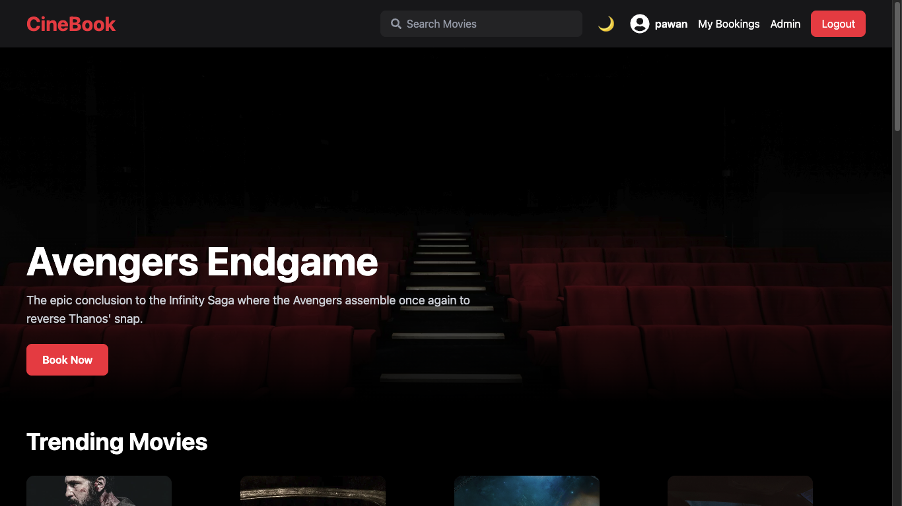
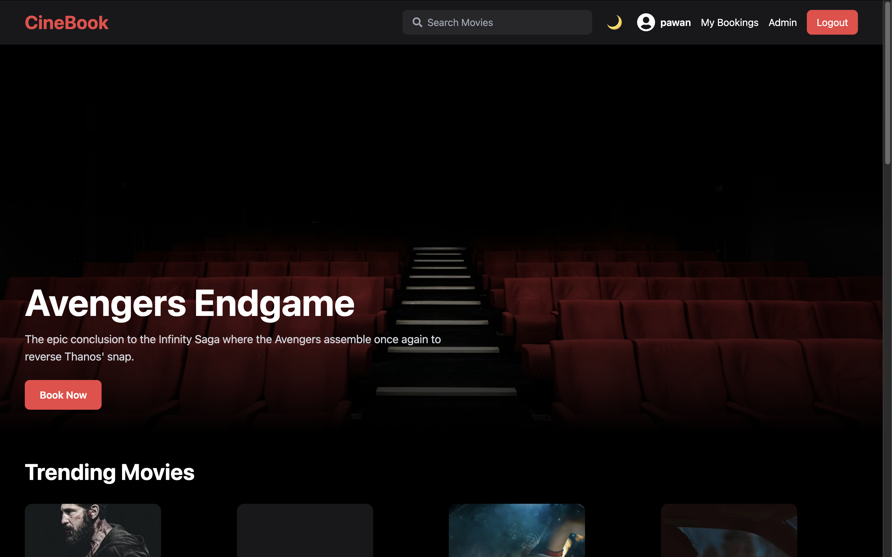
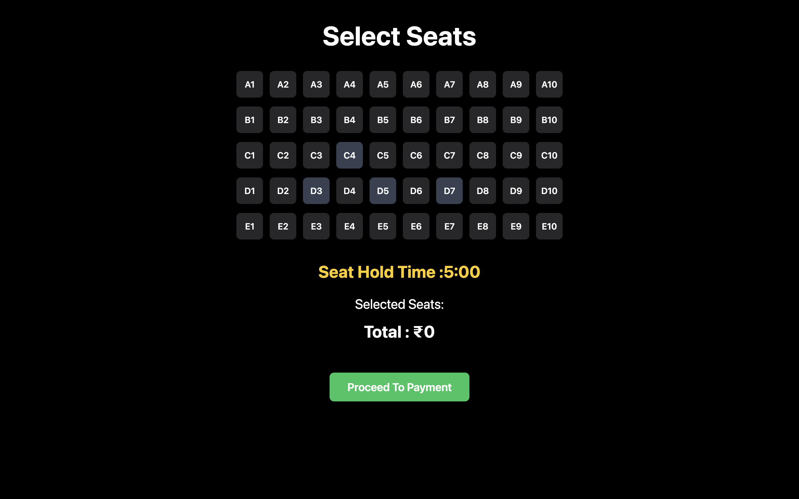
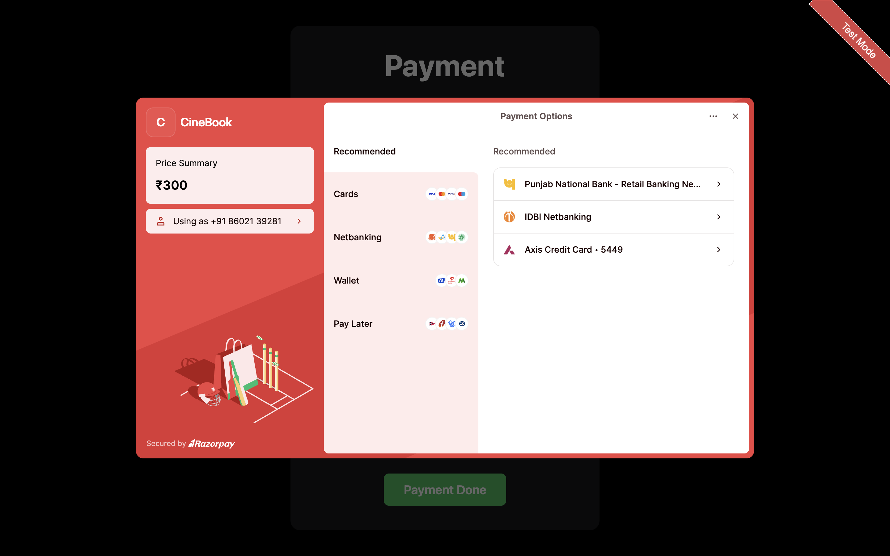
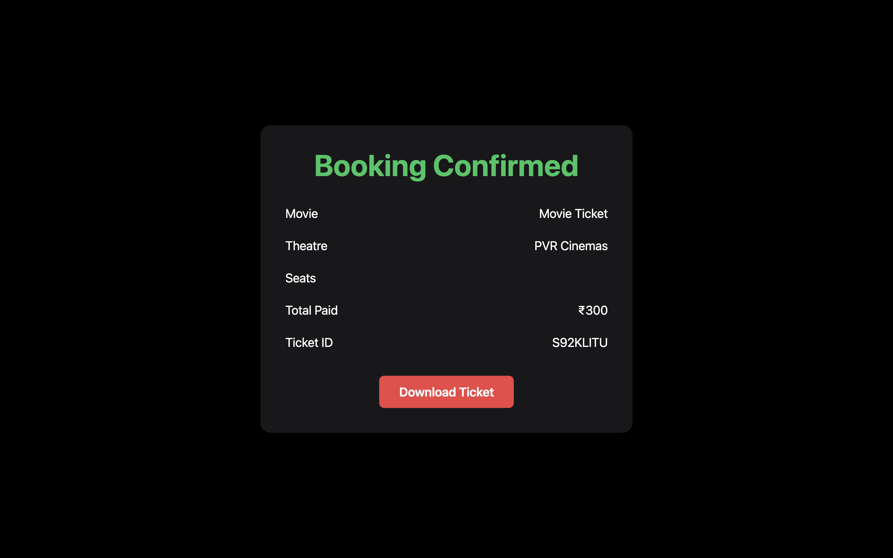

# 🎬 CineBook — Full Stack Movie Ticket Booking App

---

## 🚀 Live Demo

### 🌐 Frontend  
https://cinebook-lime.vercel.app

### ⚡ Backend API  
https://cinebook-api-iifm.onrender.com

---

# ✨ Features

✅ User Authentication (Login / Register)  
✅ Movie Search System  
✅ Trending Movies Section  
✅ Real-Time Seat Selection  
✅ Razorpay Payment Integration  
✅ Ticket Booking System  
✅ PDF Ticket Download  
✅ Mobile Responsive UI  
✅ Real-Time Booking Flow  
✅ Email Confirmation Support  
✅ Admin Panel  
✅ Dark Dark Mode UI  

---

# 🖼️ Project Screenshots

---

## 🏠 Home Page

---

## 🎟️ Seat Booking

---

## 💳 Razorpay Payment

---

## 🎫 Ticket Confirmation

##  Select Theater
Theater - (th.png)

# watch Trailer 

trailer - ( trailer.png)

# Book Food

Buy Food - ( foof.png)

# 🛠️ Tech Stack

## 🎨 Frontend

- React.js
- Tailwind CSS
- React Router DOM
- Axios
- jsPDF
- Razorpay SDK

---

## ⚙️ Backend

- Node.js
- Express.js
- MongoDB
- Mongoose
- JWT Authentication
- Nodemailer
- Socket.io

---

## ☁️ Deployment

- Vercel (Frontend)
- Render (Backend)
- MongoDB Atlas

---
